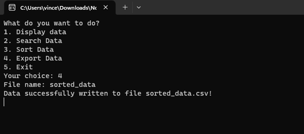

# C-Programming-Case-Study

## 📖 Description  
C programming case study solution for :  
1. **String Manipulation**: Reversing + inverse capitalization,  
2. **CSV Data Utility**: Functions to read, display, search, sort, and export `.csv` data.

### Case Study 1 (String Manipulation)
- Input validation (`1 ≤ length ≤ 100`, alphabets only).  
- String reversal + case inversion (upper ↔ lower).
 

### Case Study 2 (CSV Handler)
- **Display**: Show `n` rows of data.  
- **Search**: Filter rows by column value.  
- **Sort**: Ascending/descending by column.  
- **Export**: Save data to a new `.csv` file.

